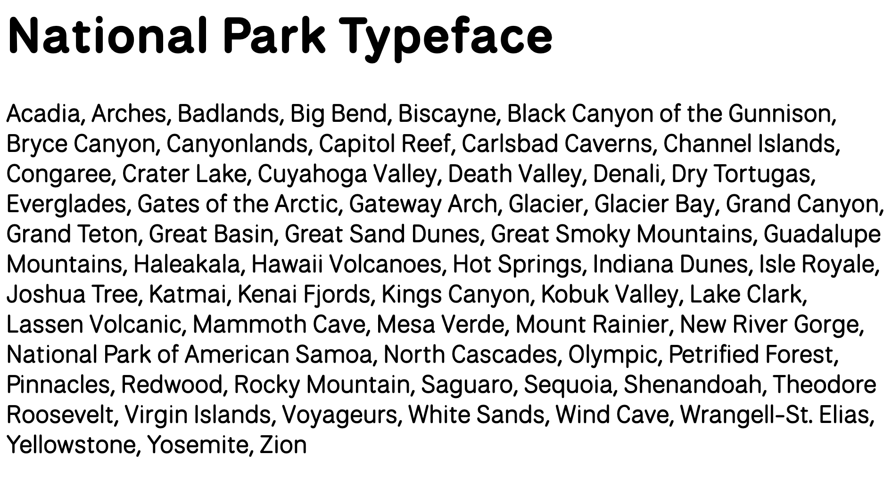

**How to use**

- Add `<link href="https://heardacat.github.io/nationalpark-webfont/nationalpark.css" rel="stylesheet" />`.
- Use `fontFamily: "NationalPark Web"` or `font-family: "NationalPark Web"`.

**Why does this exist?**

Because [National Park Font](https://nationalparktypeface.com/) is still not in Google Fonts https://github.com/google/fonts/issues/1839

